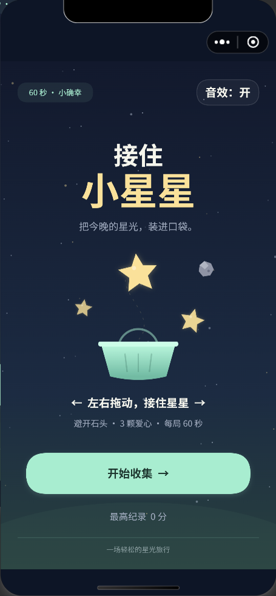
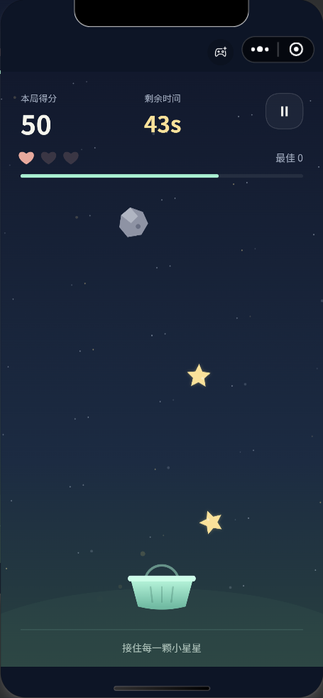

# 接住小星星 · Star Basket

一个用原生 JavaScript 和 Canvas 开发的竖屏休闲小游戏，支持微信小游戏和浏览器预览。拖动篮子接住星星、避开石头，在 60 秒内挑战本机最高分。

这个项目用于实践从游戏开发、测试、真机预览到微信平台提审的完整流程。

## 游戏画面

下图为微信开发者工具模拟器中的实际游戏画面。

<p>
  
  
</p>

## 玩法与功能

- 每局 60 秒，接住星星得分，连续接取可获得额外奖励。
- 接到石头会损失一颗爱心；三颗爱心耗尽或时间结束后结算。
- 支持暂停、继续、返回菜单和重玩。
- 支持音效开关，本机保存最高分和音效偏好。
- 单人本地玩法，没有联网对战、广告、支付、聊天或云存档。

## 本地运行

需要 Git 和 Node.js 18 或更高版本。仓库公开，可直接克隆。

```sh
 git clone https://github.com/wavachao/star-basket-wechat.git
 cd star-basket-wechat
 npm run preview
```

在浏览器打开 [http://127.0.0.1:4173](http://127.0.0.1:4173)。预览命令会自动构建资源，无需先运行 `npm install`。

电脑可用鼠标拖动，或用方向键 / A、D 移动篮子；触屏设备可左右拖动。点击开始按钮后启用音频，也可关闭音效。按 Enter 或空格开始、重玩，按 Esc 或 P 暂停、继续。

本地预览服务只监听 `127.0.0.1`；微信手机试玩需使用开发者工具生成预览二维码。

## 构建、测试与打包

| 命令 | 用途 |
| --- | --- |
| `npm run preview` | 构建并启动本地浏览器预览 |
| `npm run test` | 运行玩法、渲染和平台适配等自动化测试 |
| `npm run check` | 检查 JavaScript 语法、项目配置及微信包内容 |
| `npm run build` | 生成微信项目和浏览器预览资源 |
| `npm run package` | 构建并生成仅含微信运行工程的 ZIP |
| `npm run package:archive` | 生成含游戏、指定发布文档和截图的归档 ZIP |

构建产物不会提交到 Git，需要在克隆后自行生成：

- `dist/wechat/`：可导入微信开发者工具的小游戏项目。
- `dist/preview/`：浏览器预览文件。
- `dist/star-basket-wechat-1.0.0.zip`：仅含 `wechat/` 运行工程。版本号读取 `package.json`，更新版本后文件名自动变化。
- `dist/star-basket-wechat-1.0.0-archive.zip`：运行 `npm run package:archive` 生成，额外包含白名单中的发布文档及九张游戏截图；不包含内部续办记录、测试报告或本机调试资料。

`preview/bundle.js` 也是自动生成的文件，应修改 `src/` 中的源码后重新构建。

## 微信开发者工具

1. 运行 `npm run build`。
2. 在微信开发者工具中导入 `dist/wechat/`，项目类型为小游戏。
3. 使用该小游戏的管理员或开发者微信登录，编译并检查模拟器。
4. 生成预览二维码，扫码进行真机试玩；上传开发版本后在公众平台提交审核。

当前配置绑定本项目的小游戏 AppID。用于其他账号时，请替换为该账号自己的 AppID；下面的 `YOUR_WECHAT_APPID` 是占位符：

```sh
npm run build -- --appid YOUR_WECHAT_APPID
```

也可通过 `WECHAT_APPID` 环境变量指定。命令行参数优先，覆盖只作用于构建产物，不修改源码配置。`touristappid` 仅可用于本地预览，不能用于正式上传。

当前工作站已通过用户级 `WECHAT_DEVTOOLS` 指向共享安装的微信开发者工具，重开终端后生效。其他电脑需设置为自己的安装目录；未设置时仍兼容项目内 `.tools/wechat-devtools`。

上传版本统一读取 `package.json.version`，默认上传说明读取 `package.json.wechat.uploadDescription`，也可用 `WECHAT_UPLOAD_DESC` 临时覆盖。修改开发脚本不需要提高游戏版本；下一次发布游戏更新时再修改版本及说明。

具体导入、真机验收和发布步骤见 [微信发布指南](docs/RELEASE.md)。

## 发布进度

截至 **2026-10-02 21:38（北京时间）**，版本 `1.0.0` 已上传并成功提交微信版本审核，后台状态为“审核中”；小游戏备案已提交，隐私保护指引与 8+ 适龄设置已完成。游戏当时尚未正式发布。

这是一次发布进度记录，最新状态以微信公众平台后台为准。GitHub 中的源码和浏览器预览不代表微信小游戏已上线。

## 项目结构

```text
 game.js                  游戏入口
 game.json                小游戏配置
 project.config.json      微信开发者工具项目配置
 src/
   core.js                玩法、碰撞、计分与状态管理
   renderer.js            Canvas 绘制、屏幕适配与按钮命中
   main.js                游戏循环与交互流程
   platform.js            微信 / 浏览器输入、存储与音频适配
 assets/                  图标、分享图和音效
 preview/                 浏览器预览入口
 tools/                   构建、检查、预览、打包与微信操作工具
 tests/                   自动化测试
 release-assets/          发布记录与实际游戏截图
 docs/                    玩法约定、测试记录与发布文档
```

默认测试不需要第三方依赖；`tests/browser-smoke.cjs` 是额外的浏览器验收脚本，需要另行配置 Playwright 和浏览器环境。

## 数据与文档

游戏代码只在本机存储最高分和音效偏好，不向开发者服务器发送数据，不请求头像、昵称、手机号、位置、相册或通讯录权限。微信平台自身的数据处理不属于本项目代码的范围。

- [隐私说明](docs/PRIVACY.md)：当前代码的数据行为与本地存档说明。
- [测试报告](docs/TEST-REPORT.md)：自动化、浏览器和微信实机验证记录。
- [后台文案](docs/STORE.md)：名称、简介、玩法及自审说明。
- [发布续办记录](docs/CONTINUE-PUBLISH.md)：本项目的后台操作进度与后续待办。

本地开发工具、构建产物、缓存和登录会话不纳入仓库。`.env`、本地密钥文件也由 `.gitignore` 排除；分享资料优先使用白名单归档包，不直接分享内部 `docs/CONTINUE-PUBLISH.md`。
